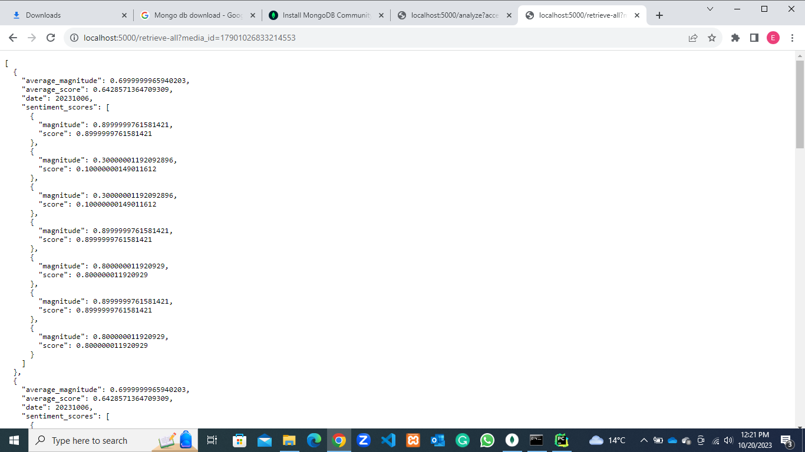
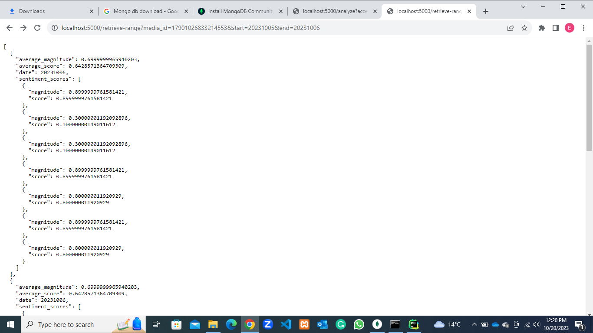
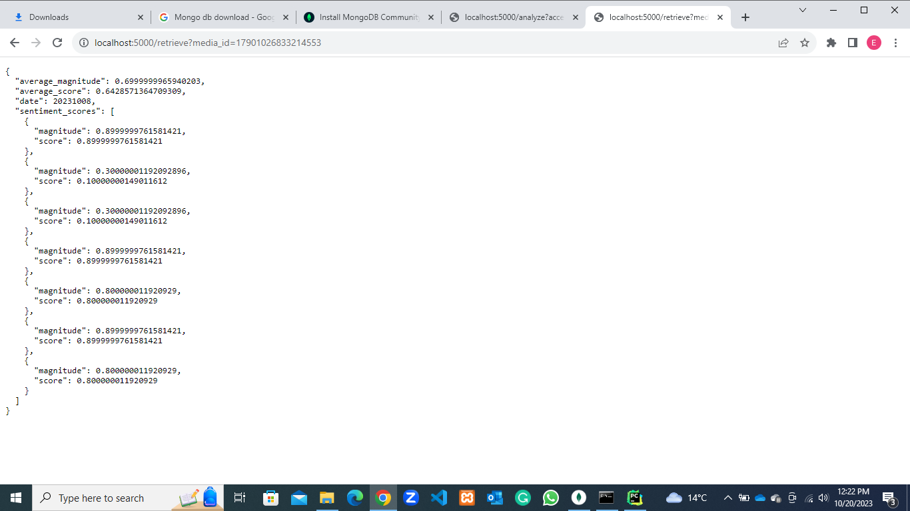

# Instagram Comment Analysis Prototype.  
Hello guys, below is an explanation of a prototype of the Instagram Sentiment Analysis using the Instagram Graph Api.
& Google NLP Api.  

# General Overview  
The idea that our project is a service and not an application, helps us to just focus on the integral functionalities of our project which is (fetching comments for a specific media on instagram and providing sentimental analysis). This prototype is able to do just that, it gets comments for a post on instagram using the /analyze endpoint and returns the result of the analysis after storing into the database. It can be used by any application as long as the right access token & media id are provided with the call. As I explained to us in our previous meeting, we don't have to worry about generating a token that can fetch any comment on instagram, as this will be provided to us by the application calling our service. It is therfore the headache of the developers of the application to generate those tokens with the right access to fetch comments from instagram.  

## Tools And Software Used  
Generally, I used Python (^3.8), Flask, PyMongo, Mongo DB (^5.0.22), Google Natural Language API. Flask was used for the HTTP requests, PyMongo serves as the client for the connetion to Mongo Db from python, Google Natural Language API for the analysis itself. NB: I recommend python 3.8 for this project as it has gRPC surpport for the google NLP. I had issues using older version. Also, I recommend Mongo DB 5.0.22 because it worked seemlessly without mongosh (Mongo Shell).  

# How To Use It  
First, we need to do the job of the application, this is necessary since we are creating a service to be used by applications therefore, in order to test it we need to provide an access token that has the permissions to fetch comments from instagram together with the id of the media for which sentiment is to be run. As in;

## /analyze  

http::localhost:5000/analyze?access_token={}&media_id={}  

this will return the average score & magnitude of the sentiment. NB: this will return the individual score & magnitude for each comment and also the calculated average of all the individual score and magnitude.  The result can be seen below;  

  

## /retrieve-all  

http::localhost:5000/retrieve-all?media_id={}  

this will return all the stored analysis for the provided media_id.  The result can be see below;  

  

## /retrieve-range  

http::localhost:5000/retrieve-range?media_id={}&start={}&end={}  

this will return all the stored analysis for the provided media_id for the duration of the start & end. NB: when the analysis is stored into the database, a date field is added which helps this endpoint to get the result for the specified duration.  The result can be see below;  

  

## /retrieve  

http::localhost:5000/retrieve-all?media_id={}  

this will return the latest stored analysis for the provided media_id.  The result can be see below;  

  

## Summary;  
In summary, the endpoints are as follows:   

GET /analyze?access_token={}&media_id={} or POST /analyze -d {access_token:"", media_id:""}  NB: To fetch and analyze the media comments, and then store the analysis in a NoSQL i.e Mongo DB before returning the analysis back as a response.   

GET /retrieve-all?media_id={} or POST /analyze -d {media_id:""}  NB: Fetches all the analysis done for a specific media.   

GET /retrieve?media_id={} or POST /analyze -d {media_id:""}  NB: Fetches the most recent analysis done for a specific media.   

GET /retrieve-range?media_id={}&start={}&end={} or POST /analyze -d {media_id:"", start:"", end:""}  NB: Fetches a range of analysis done for a specific media where start & end are dates in this format: %Y%m%d    

# Important  
Guys, please bear in mind that this is considered a prototype, no matter how meticulous I was in writing this, there could be bugs. Hence, it should be tested and corrected accordingly. Also, you need to install the various tools for this program to work. You can reach me for assistance.

